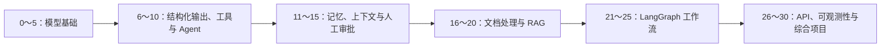

# LangChain.js × Qwen TypeScript 学习与实战

> 从第一次调用大模型，到完成一个带工具、记忆、RAG 与工作流编排能力的个人知识库 Agent。

这是一个面向中文开发者的 LangChain.js 学习分享仓库。项目包含 **0～30 共 31 个配有独立运行命令的 TypeScript 示例**，基于 Node.js 22+、LangChain.js、LangGraph 和阿里云百炼 Qwen OpenAI 兼容接口，按照“模型基础 → 工具与 Agent → 记忆与控制 → RAG → LangGraph → 工程化”的顺序逐步深入。

这里不只保存课程源码，也希望沉淀一条便于实践、调试和继续扩展的学习路径。你可以按课学习，也可以直接从感兴趣的主题进入源码。

## 项目亮点

- **渐进式学习**：每课只引入少量新概念，前后示例可以串成完整知识体系。
- **源码可运行**：每一课都有独立的 npm 脚本，便于运行、修改和对比结果。
- **中文场景友好**：默认接入阿里云百炼 Qwen，提示词、示例数据与说明均使用中文。
- **覆盖完整链路**：从模型调用一直延伸到工具、记忆、RAG、LangGraph、HTTP API、SSE 和可观测性。
- **强调工程边界**：示例包含参数校验、调用限额、人工审批、隐私信息脱敏和确定性测试。
- **配套学习资料**：仓库内提供课程文档、知识库样例和可复用的公共模块。

## 适合谁

- 已掌握 JavaScript 或 TypeScript 基础，希望系统学习大模型应用开发的开发者。
- 想用 Qwen 与 LangChain.js 搭建 Agent、RAG 或工作流应用的同学。
- 希望从“小而完整”的示例理解模型调用、状态管理和工具执行过程的学习者。
- 正在寻找 TypeScript AI 应用课程源码、分享素材或实践起点的技术团队。

完成全部示例后，你将能够独立完成模型接入、结构化输出、工具调用、Agent 状态管理、知识库检索、LangGraph 工作流以及基础 Web 服务封装。

## 学习路线



建议初学者按编号顺序学习；已有经验的开发者可以根据下面的源码导读直接选择专题。

## 快速开始

### 1. 准备环境

- Node.js 22 或更高版本
- npm
- Git
- 已开通模型调用权限的阿里云百炼 API Key
- 运行 Embedding 相关课程时，还需要开通对应的 Embedding 模型权限

### 2. 获取项目并安装依赖

```bash
git clone https://github.com/MuZi132/LangChainLearn-TS.git
cd LangChainLearn-TS
npm install
```

### 3. 配置环境变量

macOS / Linux：

```bash
cp .env.example .env
```

Windows PowerShell：

```powershell
Copy-Item .env.example .env
```

然后编辑 `.env`：

| 变量 | 用途 | 是否必需 |
| --- | --- | --- |
| `DASHSCOPE_API_KEY` | 阿里云百炼 API Key | 模型与 Embedding 示例必需 |
| `DASHSCOPE_BASE_URL` | 当前工作空间的 OpenAI 兼容接口地址 | 模型与 Embedding 示例必需 |
| `QWEN_MODEL` | 对话模型名称 | 第 1 课必须非空；第 0 课及共享模型未配置时默认使用 `qwen3.8-max` |
| `QWEN_EMBEDDING_MODEL` | Embedding 模型名称 | 第 18～20、25、30 课必需 |
| `LANGSMITH_TRACING` | 是否启用 LangSmith Trace | 可选，默认 `false` |
| `LANGSMITH_API_KEY` | LangSmith API Key | 第 28 课启用 Trace 时必需 |
| `LANGSMITH_PROJECT` | LangSmith 项目名称 | 可选 |
| `PORT` | Fastify 服务监听端口 | 可选，示例配置为 `3000` |

请勿提交 `.env`。仓库已通过 `.gitignore` 忽略该文件。

`.env.example` 中的 API Key、工作空间 ID 和模型名均为配置模板。请将 Base URL 中的工作空间 ID，以及 `QWEN_MODEL` 的值，替换为当前账号与地域实际可用的配置。

首次使用百炼时，可按官方文档依次完成配置：

1. [获取与配置 API Key](https://help.aliyun.com/zh/model-studio/get-api-key/)。
2. [选择地域、业务空间接入域名与可用模型](https://help.aliyun.com/zh/model-studio/regions/)。
3. 参考[首次调用千问 API](https://help.aliyun.com/zh/model-studio/first-api-call-to-qwen)核对请求参数。

API Key、Base URL 与模型权限必须属于相互匹配的地域和业务空间，不能把不同地域或不同套餐的凭据与地址混用。

### 4. 检查项目并运行第一课

```bash
npm run typecheck
npm test
npm run lesson:0
```

`lesson:0` 直接请求 Qwen 的 OpenAI 兼容接口，适合先排除 API Key、Base URL 和模型名称等配置问题。看到 HTTP 状态码 `200`，且模型正文包含“接口调用成功”，即可继续进入 LangChain 示例。`npm test` 只验证本地确定性工具，不会验证百炼账号或网络连接。

## 课程与源码导读

### 第一阶段：模型调用基础（第 0～5 课）

| 课程 | 源码 | 核心内容 | 运行后重点观察 |
| --- | --- | --- | --- |
| 0 | [`00-test-qwen-api.ts`](src/00-test-qwen-api.ts) | 使用原生 `fetch` 验证 OpenAI 兼容接口 | HTTP 状态码、原始响应和模型正文 |
| 1 | [`01-model.ts`](src/01-model.ts) | 使用 `ChatOpenAI.invoke()` 调用 Qwen | 返回内容与 Token 用量 |
| 2 | [`02-messages.ts`](src/02-messages.ts) | `SystemMessage`、`HumanMessage` 与多轮上下文 | 消息类型、历史顺序和上下文记忆 |
| 3 | [`03-stream.ts`](src/03-stream.ts) | 流式输出与消息块合并 | Chunk 数量、首字等待时间和总耗时 |
| 4 | [`04-batch.ts`](src/04-batch.ts) | `batch()` 与并发上限 | 并发结果、总耗时和总 Token |
| 5 | [`05-cli-chat.ts`](src/05-cli-chat.ts) | 可交互的命令行聊天程序 | `/history`、`/clear`、`/exit` 与异常回滚 |

### 第二阶段：结构化输出、工具与 Agent（第 6～10 课）

| 课程 | 源码 | 核心内容 | 运行后重点观察 |
| --- | --- | --- | --- |
| 6 | [`06-structured-output.ts`](src/06-structured-output.ts) | Zod、JSON Schema 与严格结构化输出 | 原始消息与解析后的学习计划 |
| 7 | [`07-intent-router.ts`](src/07-intent-router.ts) | 意图分类、置信度阈值与处理器路由 | 分类结果如何决定后续提示词 |
| 8 | [`08-first-tool.ts`](src/08-first-tool.ts) | 第一个工具与手动工具调用循环 | 模型请求工具、程序执行工具、模型组织答案 |
| 9 | [`09-multiple-tools.ts`](src/09-multiple-tools.ts) | 多工具注册、并行执行与最大轮数 | 多个工具结果如何回填消息历史 |
| 10 | [`10-first-agent.ts`](src/10-first-agent.ts) | `createAgent()` 自动管理模型—工具循环 | 工具依赖顺序和调用限额中间件 |

### 第三阶段：记忆、运行时上下文与控制（第 11～15 课）

| 课程 | 源码 | 核心内容 | 运行后重点观察 |
| --- | --- | --- | --- |
| 11 | [`11-short-term-memory.ts`](src/11-short-term-memory.ts) | `MemorySaver` 与短期记忆 | 相同 `thread_id` 可恢复、不同线程相互隔离 |
| 12 | [`12-long-term-memory.ts`](src/12-long-term-memory.ts) | `InMemoryStore` 与跨线程长期记忆 | 用户偏好如何按 namespace 和 key 保存 |
| 13 | [`13-runtime-context.ts`](src/13-runtime-context.ts) | `ToolRuntime`、租户与角色上下文 | 工具如何执行服务端权限判断 |
| 14 | [`14-middleware.ts`](src/14-middleware.ts) | 自定义 Middleware 与调用限额 | 模型前后钩子、工具耗时和调用保护 |
| 15 | [`15-human-in-loop.ts`](src/15-human-in-loop.ts) | Human-in-the-loop 敏感操作审批 | 删除工具如何暂停、批准并恢复执行 |

### 第四阶段：文档处理与 RAG（第 16～20 课）

| 课程 | 源码 | 核心内容 | 运行后重点观察 |
| --- | --- | --- | --- |
| 16 | [`16-documents.ts`](src/16-documents.ts) | `Document`、文本加载器与 PDF 解析 | `pageContent`、`metadata` 和页码 |
| 17 | [`17-text-splitting.ts`](src/17-text-splitting.ts) | 面向中文的递归文本切分 | Chunk 大小、重叠和来源元数据 |
| 18 | [`18-embeddings.ts`](src/18-embeddings.ts) | Embedding 与余弦相似度 | 语义相近文本的相似度变化 |
| 19 | [`19-vector-retriever.ts`](src/19-vector-retriever.ts) | `MemoryVectorStore` 与 Retriever | 相似度分数和 Top-K 检索结果 |
| 20 | [`20-rag.ts`](src/20-rag.ts) | 完整 RAG 问答链路 | 文档加载、切分、索引、检索、回答与来源 |

### 第五阶段：LangGraph 工作流（第 21～25 课）

| 课程 | 源码 | 核心内容 | 运行后重点观察 |
| --- | --- | --- | --- |
| 21 | [`21-langgraph-basics.ts`](src/21-langgraph-basics.ts) | State、Node、Edge 与 Reducer | 状态在两个节点之间如何累积 |
| 22 | [`22-langgraph-routing.ts`](src/22-langgraph-routing.ts) | 条件边与意图分支 | 分类节点如何路由到技术、闲聊或澄清节点 |
| 23 | [`23-langgraph-persistence.ts`](src/23-langgraph-persistence.ts) | Checkpointer、持久化状态与恢复 | 相同线程的两次调用如何共享消息 |
| 24 | [`24-langgraph-interrupt.ts`](src/24-langgraph-interrupt.ts) | `interrupt()` 与 `Command` | 图如何暂停、接收审批结果并跳转 |
| 25 | [`25-langgraph-rag-agent.ts`](src/25-langgraph-rag-agent.ts) | 用 LangGraph 编排检索与回答 | `retrieve → answer` 的状态变化 |

### 第六阶段：服务化、可观测性与综合项目（第 26～30 课）

| 课程 | 源码 | 核心内容 | 运行后重点观察 |
| --- | --- | --- | --- |
| 26 | [`26-fastify-api.ts`](src/26-fastify-api.ts) | Fastify、CORS、请求校验与多轮聊天 API | `/health`、`/chat` 和 `threadId` |
| 27 | [`27-agent-sse.ts`](src/27-agent-sse.ts) | Agent 流式事件与 SSE | `token`、`done` 事件及连接生命周期 |
| 28 | [`28-langsmith.ts`](src/28-langsmith.ts) | LangSmith Trace、Tag 与 Metadata | 调用链、运行名称和项目归属 |
| 29 | [`29-testing-guardrails.ts`](src/29-testing-guardrails.ts) | PII 脱敏、模型/工具限额与可测试工具 | 邮箱遮盖和确定性计算结果 |
| 30 | [`30-capstone.ts`](src/30-capstone.ts) | 综合项目：个人知识库 Agent | 检索工具、长期偏好、短期会话和来源引用 |

所有课程命令都定义在 [`package.json`](package.json) 中，统一使用以下格式运行：

```bash
npm run lesson:<课程编号>
```

部分示例支持从命令行传入问题：

```bash
npm run lesson:7 -- "请帮我制定 LangChain 学习计划"
npm run lesson:20 -- "LangGraph 的 interrupt 适合什么场景？"
npm run lesson:22 -- "你好，今天学习什么？"
```

### 课程运行依赖速查

| 课程 | 运行时依赖 | 备注 |
| --- | --- | --- |
| 0～15 | Qwen 对话模型与网络连接 | 第 5 课需要命令行交互 |
| 16～17 | 仅本地运行 | 第 16 课可选读取 `data/sample.pdf` |
| 18～19 | Qwen Embedding 模型与网络连接 | 不调用对话模型 |
| 20 | Qwen 对话模型与 Embedding 模型 | 使用本地 Markdown 知识库 |
| 21 | 仅本地运行 | 线性 StateGraph 示例 |
| 22～23 | Qwen 对话模型与网络连接 | 第 23 课的 Checkpointer 为内存实现 |
| 24 | 仅本地运行 | 在代码中演示暂停与恢复 |
| 25 | Qwen 对话模型与 Embedding 模型 | LangGraph RAG 工作流 |
| 26～27 | Qwen 对话模型与本地端口 | 需要保持服务进程运行 |
| 28 | Qwen 对话模型；LangSmith 可选 | 启用 Trace 后需要 LangSmith API Key |
| 29 | Qwen 对话模型与网络连接 | PII 脱敏、调用限额和工具执行 |
| 30 | Qwen 对话模型与 Embedding 模型 | 个人知识库 Agent 综合示例 |

“仅本地运行”表示源码本身不调用模型服务；首次安装 npm 依赖仍需要网络。调用真实模型或 Embedding 服务可能产生费用。

## 一条完整的 RAG 数据链路

第 20、25、30 课会复用同一套知识库构建逻辑：

```text
data/knowledge/*.md
  → loadMarkdownKnowledge() 读取 Markdown
  → RecursiveCharacterTextSplitter 切分知识块
  → Qwen Embedding 生成向量
  → MemoryVectorStore 建立内存索引
  → Retriever / similaritySearch 检索相关内容
  → Qwen 根据检索上下文生成回答
```

这条链路的主要实现位于 [`src/lib/knowledge.ts`](src/lib/knowledge.ts)，适合作为理解 RAG 示例的源码入口。

## 仓库结构

```text
LangChainLearn-TS/
├─ src/
│  ├─ 00-*.ts ... 30-*.ts      # 按学习顺序编号的独立课程示例
│  └─ lib/                     # 模型、环境变量、知识库和测试工具等公共模块
├─ data/
│  └─ knowledge/               # RAG 示例使用的 Markdown 知识库
├─ tests/
│  └─ 29-tools.test.ts         # 不依赖模型网络调用的确定性工具测试
├─ doc/
│  └─ LangChain_TS_Qwen_Complete_Course_00-30.docx
│                              # 第 0～30 课配套课程文档
├─ .env.example                # 环境变量模板
├─ package.json                # 依赖与课程运行脚本
└─ tsconfig.json               # TypeScript 严格模式配置
```

### 公共源码模块

| 文件 | 职责 | 被哪些主题复用 |
| --- | --- | --- |
| [`src/lib/model.ts`](src/lib/model.ts) | 创建 Qwen 对话模型与 Embedding 模型，集中设置超时、重试和模型参数 | 第 6～15、18～20、22～23、25～30 课 |
| [`src/lib/env.ts`](src/lib/env.ts) | 读取并校验必需环境变量 | 模型工厂 |
| [`src/lib/knowledge.ts`](src/lib/knowledge.ts) | 读取 Markdown、切分文本并构建内存向量库 | 第 20、25、30 课 |
| [`src/lib/calculator.ts`](src/lib/calculator.ts) | 提供确定性的加法工具，便于演示 Guardrails 和单元测试 | 第 29 课与测试 |
| [`src/lib/format.ts`](src/lib/format.ts) | 将模型的多种内容格式转换为便于输出的文本 | 可复用辅助函数 |

## Web API 示例

第 26 课启动普通 JSON API。请在第一个终端保持服务运行，再用第二个终端发送请求：

```bash
npm run lesson:26
```

```powershell
Invoke-RestMethod http://localhost:3000/health

$body = @{ message = "解释 TypeScript 的 unknown 类型"; threadId = "demo-001" } | ConvertTo-Json
Invoke-RestMethod http://localhost:3000/chat -Method Post -ContentType "application/json" -Body $body
```

第 27 课启动 SSE 流式接口。保留 `.env` 中供第 26 课使用的 3000 端口，在新的 PowerShell 终端中临时覆盖为 3001：

```powershell
$env:PORT = "3001"
npm run lesson:27
```

再打开另一个终端验证 SSE 事件流：

```powershell
curl.exe -N -X POST http://localhost:3001/chat/stream `
  -H "Content-Type: application/json" `
  -d '{"message":"请用三点解释 RAG"}'
```

正常情况下会依次收到多个 `event: token`，最后收到 `event: done`。服务可使用 `Ctrl+C` 停止。

| 示例 | 方法与路径 | 请求体 | 返回形式 |
| --- | --- | --- | --- |
| 第 26 课健康检查 | `GET /health` | 无 | `{ "ok": true }` |
| 第 26 课聊天 | `POST /chat` | `{ "message": "...", "threadId": "..." }` | JSON |
| 第 27 课流式聊天 | `POST /chat/stream` | `{ "message": "..." }` | SSE `token` / `done` 事件 |

## 推荐学习方式

每一课都可以按照下面的循环练习：

1. 先阅读源码，找出输入、外部调用、关键状态和最终输出。
2. 暂不运行，预测模型或工作流会返回什么。
3. 执行对应的 `npm run lesson:<编号>`，记录真实结果。
4. 每次只改变一个变量，例如提示词、并发数、Chunk 大小、Top-K 或 `thread_id`。
5. 对比修改前后的输出、耗时、Token 和检索来源，总结适用边界。

可复制下面的模板记录学习过程：

```markdown
## 第 N 课：主题

- 本课目标：
- 运行命令：
- 我预测的结果：
- 实际结果：
- 最关键的源码位置：
- 修改的一个参数：
- 修改前后差异：
- 仍然不理解的问题：
- 可以迁移到真实项目的做法：
```

### 可以继续完成的实践

- 把第 11～12、23～24 课的内存存储替换为数据库或 Redis 持久化实现。
- 为第 20 课增加引用编号、召回率评估和“资料不足”测试集。
- 为第 26～27 课补充身份认证、限流、取消请求和统一错误处理。
- 将第 30 课改造成带前端页面、持久化向量库和用户隔离的完整应用。
- 为工具、路由、文本切分和 API 增加更多不依赖真实模型的自动化测试。

## 测试与质量检查

```bash
npm run typecheck
npm test
```

- `typecheck` 使用 TypeScript 严格模式检查 `src/` 与 `tests/`。
- 当前单元测试验证了 `calculator` 工具的确定性行为。
- 模型和 Embedding 示例依赖真实网络、账号权限与外部服务，不属于现有单元测试覆盖范围。
- 建议提交学习成果前至少运行类型检查和测试，再单独验证本次修改涉及的课程。

## 常见问题与使用边界

### 提示缺少环境变量

确认已将 `.env.example` 复制为 `.env`，并填写 `DASHSCOPE_API_KEY`、`DASHSCOPE_BASE_URL` 和所需模型名称。Base URL 需要与当前阿里云百炼工作空间匹配。

### 对话正常，但 Embedding 课程失败

第 18～20、25、30 课还会调用 `QWEN_EMBEDDING_MODEL`。请确认账号已开通对应模型，并检查模型名称是否可用。

### 第 16 课没有解析 PDF

这是预期行为。将测试文件放到 `data/sample.pdf` 后重新运行；文件不存在时，示例只展示手动创建的 Document 与 Markdown 加载器。

### 第 27 课仍监听 3000 端口

源码只有在 `PORT` 未定义时才默认使用 3001，而示例 `.env` 已定义 `PORT=3000`。如果要同时运行第 26、27 课，请保留第 26 课的 3000 端口，并在第 27 课所在终端临时设置 `PORT=3001`；直接修改 `.env` 会同时改变两个示例的端口。

### 安装后出现 LangChain 类型或 API 差异

当前 `package.json` 使用 `latest` 依赖且仓库未固定 lockfile，重新安装时可能获得更新后的 API。请先运行 `npm run typecheck`，再根据已安装版本对照官方文档；团队协作或长期维护时建议固定依赖版本并提交 lockfile。

### 这些示例可以直接用于生产环境吗

不建议直接照搬。课程中的 Checkpointer、Store 和 VectorStore 主要使用内存实现，进程退出后数据会丢失；API 示例也没有完整的认证、授权、限流、审计和持久化方案。生产化前还需要补齐安全、成本、可靠性与评估体系。

调用真实模型和 Embedding 服务可能产生费用，请在学习时关注调用次数、Token 用量与账号配额。

## 交流与共建

欢迎通过 [Issues](https://github.com/MuZi132/LangChainLearn-TS/issues) 分享：

- 课程运行结果与踩坑记录；
- 不同 Qwen 模型或 LangChain 版本的兼容性经验；
- 对示例的疑问、修复建议与实践扩展；
- 基于本仓库完成的 Agent、RAG 或 LangGraph 项目。

提交 Pull Request 前，请确认：

1. 示例保持聚焦，能够说明一个明确的学习目标。
2. 新增或修改的说明、注释和文档使用中文。
3. API Key、个人数据和本地 `.env` 未被提交。
4. 已运行 `npm run typecheck` 与 `npm test`。
5. README、课程编号和 `package.json` 脚本保持一致。

## 课程资料与许可

- 配套课程文档：[`doc/LangChain_TS_Qwen_Complete_Course_00-30.docx`](doc/LangChain_TS_Qwen_Complete_Course_00-30.docx)
- 示例知识库：[`data/knowledge/`](data/knowledge/)
- 开源许可：[MIT License](LICENSE)
- 作者：李志刚

如果这个仓库帮助你完成了第一个 LangChain.js 应用，欢迎留下学习反馈，也欢迎把你的改造思路分享给更多学习者。
